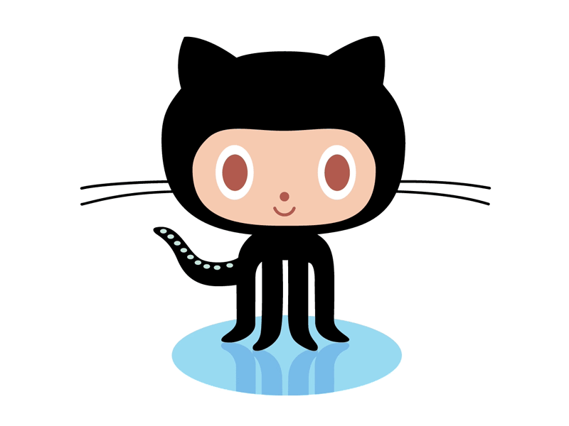

### :snowflake: Mub :snowflake:	
 I'm a high schooler from North Carolina
-  I’m 15 years old

- How to reach me: [Discord](https://discord.bio/p/mub)

	

### Learning

	<!-- Programming Languages. -->
	&emsp;
	<a href='#'>
		<code></code>
	</a>
	&emsp;
	</a>  
	

	

### GitHub Stats

---

  
🔧 GitHub Stats

  
  

  
🔧 Most Used Languages

